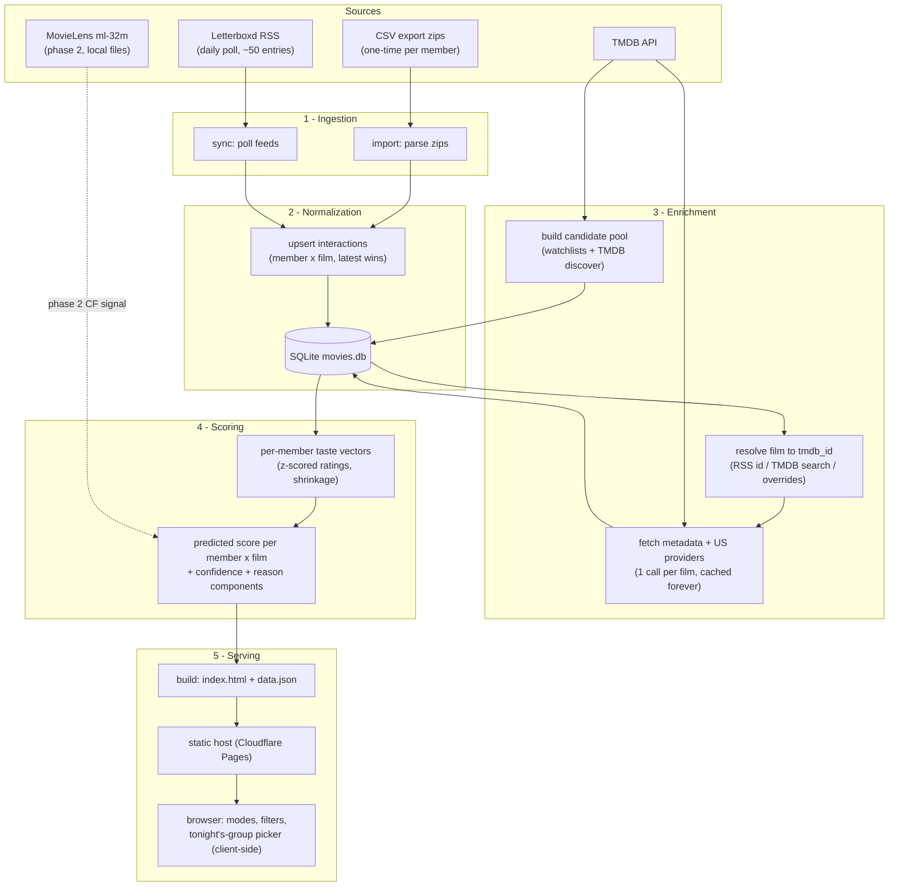

# Group Movie Recommender — Scoping Document

**Status:** scoping only, no code yet. **Date:** 2026-08-25.
**Name:** `lore` (was `movienight`; renamed 2026-08-26).

A tool that ingests a small friend group's public Letterboxd histories and produces
ranked, filtered, explainable recommendations for whoever is in the room tonight.
Hobby-grade: boring, cheap, free-tier, batch.

All externally sourced claims below were verified against the live services on
2026-08-25 (sources at the end). Facts I could not verify are marked **UNVERIFIED**.

---

## 0. Summary of decisions

| Decision | Call | One-line why |
|---|---|---|
| Product shape | **(a) Personal tool** → static site generated by a pipeline you run | The only thing a web app buys is self-serve onboarding for a static group of ~5 people you already text with |
| Stack | **Python pipeline + SQLite + static HTML/JS output** | Phase 1 is data wrangling and batch scoring, phase 2 is scipy/implicit territory; there is no server, so "one language" buys nothing |
| Backfill | **Account-settings CSV export** (each friend, once) | Free, complete, ToS-clean; scraping is now explicitly prohibited by Letterboxd's ToS (Dec 2025) |
| Incremental | **Public RSS, polled daily** | Verified: carries `tmdb:movieId`, rating, watched date, rewatch flag, like flag; ~50 entries deep |
| Film identity | **TMDB id** | Letterboxd's own catalog is TMDB-backed; RSS hands us the id for free going forward |
| Enrichment | **TMDB API** (`append_to_response`, cached in SQLite, 1 call/film ever) | Free tier, ~50 req/s ceiling, includes US watch providers (JustWatch data, attribution required) |
| Per-user model, phase 1 | **Content-based over TMDB features, z-scored ratings, shrinkage to a prior** | Explainable, cold-start safe, no external corpus dependency |
| Per-user model, phase 2 | **+ item-item CF on MovieLens ml-32m** where coverage allows | ml-32m is frozen at Oct 2023 and thin in the tail — it can only ever be a gated bonus signal |
| Group aggregation default | **Average without misery** (mean score, hard floor on any present member's predicted rating) | Pure average sacrifices one person; pure least-misery converges on beige. Others available as toggles |
| Hosting / scheduling | Phase 1: run locally, deploy static output to Cloudflare Pages (or open `site/index.html`). Phase 2: GitHub Actions nightly cron | Free tiers, nothing to keep alive |

---

## 1. Decision 1 — product shape: personal tool, not web app

**Chosen: (a) personal tool.** You run the pipeline; output is a static page at a
stable (unlisted) URL your friends bookmark.

Reasoning against the stated criteria:

- **Public profiles ⇒ ingestion needs no auth.** The only capability a web app
  adds is friends registering themselves and triggering their own syncs. In a
  small, static group, "registration" is you adding one line to `config.toml`,
  and syncing is a cron job. Both are one-time or automatic; a signup flow
  automates the part that never happens.
- **You are the only maintainer.** A web app is a *process* (uptime, deps,
  security patches, broken deploys discovered by friends before you). A pipeline
  plus static output is a *artifact*: if the generator breaks, yesterday's page
  still works, and nothing is down while you fix it at your leisure.
- **The interactive requirements don't need a server.** Filters, the
  tonight's-group picker, and mode switching all operate on precomputed
  per-member × per-film scores. Ship those in a `data.json` (~1–3 MB for this
  group size) and do filtering/aggregation client-side in vanilla JS. The page
  *feels* like an app; there is no backend.
- **The one real cost of (a):** friends can't add a veto or fix their username
  without going through you. Acceptable at this scale; the veto file is a
  30-second edit. Phase 3 sketches a zero-backend feedback capture if it rankles.

The backfill step (each friend exports their own CSV zip once and sends it to
you) is identical under both shapes — a web app cannot export another person's
account either — so shape (b) doesn't even remove the project's one manual step.

## 2. Decision 2 — stack: Python, and yes, phase 1 is a script plus static output

**Chosen: Python 3.12+ pipeline (uv-managed), SQLite, Jinja2-rendered static
site with a few hundred lines of hand-written vanilla JS.**

Which factor matters more here: **the recsys/data ecosystem wins, because the
"one language" argument mostly evaporates under decision 1.** The JS/TS case
("ingestion and UI in one language") presumes a UI codebase worth unifying with.
There isn't one: the UI is one HTML template and a small client-side scorer.
Meanwhile the pipeline is CSV wrangling, fuzzy matching, feature vectors, and —
in phase 2 — sparse matrix math over a 32M-rating corpus, where pandas /
numpy / scipy / `implicit` are the paved road and the Node equivalents are the
dirt track.

Honest form of the answer, as requested: **phase 1 is a ~800-line Python CLI
that reads zips and feeds, writes SQLite, and emits `site/index.html` +
`data.json`. That is the whole system.** No framework, no server, no build
tooling beyond `uv`.

Proposed dependencies (phase 1): `httpx`, `feedparser`, `pandas`, `jinja2`,
`pyyaml`, `tenacity`. Phase 2 adds `numpy`/`scipy` (and optionally `implicit`).

Rejected alternatives, briefly:
- **Next.js/TS on Vercel:** fine platform, wrong shape — introduces a deploy
  pipeline and framework churn to serve what is a nightly batch artifact.
- **Notebook-only:** fails the "friends can use it without you" bar.
- **Postgres/hosted DB:** SQLite is embarrassingly sufficient for ~10⁴ rows.

---

## 3. Architecture



Everything left of "Serving" is one CLI (`lore <cmd>`) run on demand
(phase 1) or by cron (phase 2). The browser never talks to anything but static
files; per-session group selection works because `data.json` carries
per-member scores and the page aggregates for the selected subset on the fly.

---

## 4. Letterboxd ingestion paths (verified 2026-08-25)

### 4a. Backfill — settings CSV export ✅ *recommended*

Verified: self-serve export exists for one's own account (Settings → Data →
export), is **not** gated to the paid Pro tier (the Pro feature page makes no
mention of export, and Letterboxd's help center describes it as an account
feature; one SEO spam page claiming "Pro only" is wrong). The zip contains
CSVs including `watched.csv`, `ratings.csv`, `diary.csv`, `watchlist.csv`,
`reviews.csv`, profile/comments/lists files, and a `likes/` folder.

Verified columns:

| File | Columns |
|---|---|
| `watched.csv` | Date, Name, Year, Letterboxd URI |
| `ratings.csv` | Date, Name, Year, Letterboxd URI, Rating (0.5–5.0) |
| `diary.csv` | Date, Name, Year, Letterboxd URI, Rating, Rewatch, Tags, Watched Date |
| `watchlist.csv` | Date, Name, Year, Letterboxd URI |

Notes that matter:
- **No TMDB or numeric film id anywhere in the export** (a known community
  complaint). The Letterboxd URI in `ratings.csv`/`watched.csv` points at the
  film page (slug extractable); in `diary.csv` it points at the member's
  viewing page (slug still extractable from the path). So the export gives us
  a stable *Letterboxd slug* per film, and enrichment must map slug/title/year
  → TMDB id (§5).
- "Rating" in `ratings.csv` is the member's *current* rating; diary rows carry
  the rating at logging time. Rule: `ratings.csv` wins for current taste,
  diary supplies dates/rewatches.
- Each member can only export **their own** data, so each friend does it once
  (~2 minutes) and sends you the zip. This is the entire manual cost of the
  ToS-clean design.

### 4b. Backfill alternative — scraping `/{user}/films/`

Verified mechanics (probed live against real profiles including
`letterboxd.com/zachshort/films/`, paginating as `/films/page/2/` etc.):
- Grid pages are server-rendered at **72 films/page** with the owner's rating
  present in the HTML (`<span class="rating -micro rated-7">★★★½</span>`,
  `rated-N` = N half-stars) and the film slug in data attributes.
- Cost for a 2,000-film history: ceil(2000/72) = **28 requests per person**
  (your 948 films = 14 pages). Trivial technically.

Why it is not the primary path:
- **Letterboxd's Terms of Use (last updated December 2025) now prohibit it in
  so many words:** "you must not employ any robot, spider, scraper, deep-link,
  or other automated data gathering or extraction tool, program, or algorithm
  to access, acquire, copy, or monitor any portion of the Service," and "You
  agree to access the Service through the interface we provide."
- Enforcement is real: during this research, an identified non-browser fetcher
  received **HTTP 403 on ordinary pages** (even `/legal/terms-of-use/` and RSS),
  and `robots.txt` blocks 28 named AI/data crawlers site-wide. Community
  scrapers work by sending browser-like user agents — i.e., by pretending not
  to be scrapers — which fails your own "real user agent" politeness bar and
  can break silently any day.
- The grid also lacks watch dates and watchlists (separate pages), so it's a
  worse dataset than the export even ignoring ToS.

**Position: keep a scraper out of the design. If a friend simply never sends
their zip, the honest fallback is nagging them, not automation.** (If you ever
decide otherwise for your own account, it's 14 requests — but the export is
strictly better data for the same two minutes.)

### 4c. Incremental — public RSS ✅ *recommended*

Verified live against two real feeds:
- URL: `https://letterboxd.com/{user}/rss/`. Depth observed: **50 items**
  (zachshort) to **100 items** (a very active critic account) — plan on 50.
- Content: diary watches (`<guid>letterboxd-watch-…`), reviews
  (`letterboxd-review-…`), and list activity (`letterboxd-list-…`). This
  matches Letterboxd's own description: "an RSS feed of new diary entries,
  reviews and lists."
- Per-item fields (verified): `letterboxd:filmTitle`, `letterboxd:filmYear`,
  `letterboxd:memberRating` (e.g. `4.0`), `letterboxd:watchedDate`,
  `letterboxd:rewatch`, `letterboxd:memberLike`, and — the big one —
  **`tmdb:movieId`**. Incremental rows arrive pre-resolved to TMDB. 🎉

Assessment: at this group's watch rate (you: 36 films logged YTD), a **daily
poll of one request per member keeps us current with zero manual steps**, with
~10× headroom before a 50-entry window could overflow between polls.

Known blind spots (mitigations in §10):
- Films **marked watched or rated without a diary entry** don't appear
  (**UNVERIFIED** exact behavior — test with our own accounts in week 1).
- **Watchlist changes don't appear** (feed is diary/reviews/lists only).
- Deletions and back-dated edits older than the window are invisible.
- Drift fix: any member re-sends a fresh export whenever convenient
  (quarterly-ish); imports are idempotent upserts, so re-imports are free.

### 4d. Official API — closed to us, definitively

Verified from Letterboxd's current API page: access is by emailed request only,
and — exact quote — "At this time we are not granting access for
**data-analysis, visualization or recommendation projects**, for **LLM or
GPT-related use**, for **private or personal projects**, or for any usage that
recreates current or planned features of our paid subscription tiers."

This project is excluded on (at least) three independent grounds, so the API is
not a fallback — it's a dead end. Notably, the same page *endorses* our chosen
design: "If you require your account data in a machine-readable format, we
provide import and export facilities, and every member profile has an RSS
feed…" and recommends TMDB directly for film metadata. **Our architecture is
literally the one Letterboxd tells hobbyists to build.**

### 4e. Politeness spec (applies to everything we fetch)

- RSS poller: one request per member per day, sequential with 2 s spacing,
  honest User-Agent `lore/0.1 (+mailto:<your-contact>)`, conditional GET
  (`If-Modified-Since`/ETag) if the server honors it, exponential backoff and
  a skipped cycle on any 403/429.
- All fetched resources cached in SQLite with `fetched_at`; nothing is ever
  re-fetched because a *view* changed.
- `robots.txt` for `User-agent: *` disallows only filter/sort URL variants
  (popularity, availability, decade filters, etc.) — none of which we touch.
- TMDB: stay far under the ~50 req/s ceiling (we'll self-limit to ~10/s
  during the one-time backfill, then it's a trickle).

### Recommendation

**Primary: CSV export backfill + daily RSS incremental. Fallback: re-export on
drift.** Fastest path to a working phase 1 is also this one: you can export
your own zip *today* and build the whole pipeline against it; friends' zips
slot in as they arrive, and RSS keeps everyone current from then on.

---

## 5. Metadata enrichment (TMDB)

Letterboxd's own film database is sourced from TMDB (their film pages carry
`data-tmdb-id` and link to TMDB; verified live), so TMDB id is the natural
canonical key and coverage of anything on Letterboxd is effectively total.

### Resolution ladder (slug/title/year → tmdb_id)

1. **RSS rows: free.** `tmdb:movieId` comes in the feed. Covers 100% of
   incremental data forever.
2. **Exact search:** TMDB `/search/movie?query=<title>&primary_release_year=<year>`.
   Accept iff exactly one candidate matches normalized title (case/diacritics/
   punctuation-folded, compare against both `title` and `original_title`) with
   year within ±1 (Letterboxd and TMDB disagree on festival-vs-release years).
   If multiple: prefer exact title + exact year + highest `vote_count`; accept
   only if the winner is unambiguous by a clear margin. Expected to clear
   ~90–95% of backfill rows.
3. **Manual overrides:** `overrides.yaml` mapping Letterboxd slug → tmdb_id for
   the stubborn residue (shorts, remakes sharing title+year, retitled foreign
   releases). Every unresolved film lands in `resolution_report.md` with a
   search link, so fixing one is a 20-second paste.
4. **Optional gray-area fallback (off by default):** fetch the film's
   Letterboxd page (URL is right there in the CSV) and read `data-tmdb-id`
   from the body tag — verified present. It is authoritative (it *is*
   Letterboxd's own mapping) and would be a few hundred one-time cached
   requests, but it is automated page fetching and therefore sits inside the
   ToS prohibition in §4b. Ship it as a flag you consciously enable, or don't
   ship it. Expected need if step 2 is decent: ~50–300 films, i.e. a very
   survivable evening of manual overrides instead.

Identity edge cases to handle explicitly: Letterboxd carries some TV/miniseries
entries that are TMDB *TV* objects, not movies (RSS `tmdb:movieId` implies
movie; anything unresolvable as a movie gets flagged, default-excluded, and a
`kind` column reserves room to include them later). Shorts resolve fine but are
default-filtered by runtime (<40 min) with a toggle.

### What to cache per film (one API call each)

`GET /movie/{id}?append_to_response=credits,keywords,watch/providers`
→ store: title, original title, year, release date, runtime,
original_language, genres, keywords, top ~10 billed cast, directors + writers,
popularity, vote_average, vote_count, poster_path, overview, and the **US**
`watch/providers` block (flatrate / rent / buy).

### Caching & rate-limit strategy

- SQLite is the cache; key = tmdb_id. Core metadata: fetch once, refresh
  never (a 90-day optional refresh exists but is cosmetic).
- **Watch providers churn**, so they get their own `fetched_at` and a weekly
  refresh *only for films currently in the candidate pool / watchlists*
  (~1–2.5k requests/week worst case, minutes at 10 req/s).
- Backfill math for this group: ~5 members × ~1,000–2,000 films ≈ 3–6k unique
  films ≈ 3–6k requests one time ≈ **5–10 minutes** at a polite 10 req/s
  (ceiling is ~50/s per TMDB's current docs).
- TMDB terms: free for non-commercial use with attribution; provider data
  additionally requires **JustWatch attribution on each media item** where
  displayed. The site footer + per-card "streaming data: JustWatch via TMDB"
  covers both.

---

## 6. Data model (SQLite: `data/movies.db`)

```
member        id PK · username UNIQUE · display_name · added_at
film          id PK · lb_slug UNIQUE · tmdb_id UNIQUE NULL · imdb_id NULL
              · title · year · kind (movie|tv|short) · resolution_status
              (resolved|ambiguous|unmatched|pending) · resolution_method
              (rss|search|override|page) · resolved_at
film_tmdb     film_id PK→film · runtime_min · original_language · release_date
              · genres JSON · keywords JSON · cast JSON · directors JSON
              · writers JSON · popularity · vote_average · vote_count
              · poster_path · overview · fetched_at
providers     (film_id→film, region) PK · flatrate JSON · rent JSON · buy JSON
              · fetched_at
interaction   (member_id, film_id) PK · watched BOOL · rating REAL NULL
              · liked BOOL · in_watchlist BOOL · first_watched · last_watched
              · rewatch_count · source (csv|rss) · updated_at
diary_entry   id PK · member_id · film_id · watched_date · rating · rewatch
              · tags JSON · source          -- richness; not required by phase 1 scoring
rss_state     member_id PK · last_seen_guid · last_polled_at
score         (member_id, film_id, model_version) PK · z REAL · stars REAL
              · confidence REAL · components JSON · computed_at
meta          key PK · value
```

- `interaction` is the workhorse: one row per member×film collapsing
  watched/rating/like/watchlist, upserted with latest-wins semantics — which
  is what makes CSV re-imports and RSS replays idempotent.
- Vetoes and config live in **files, not the DB** (human-edited, git-diffable):
  `config.toml` (members, streaming services, region, runtime default),
  `veto.yaml` (slug → {by, why, date}), `overrides.yaml` (slug → tmdb_id).
- `film.id` is internal so unresolved films exist and rank in reports;
  `tmdb_id` is the join key to enrichment and (phase 2) MovieLens
  `links.csv`.
- Derived artifact: `site/data.json` — films (metadata + providers + reasons),
  members, per-member×film {stars, z, confidence}, seen/rating matrix, veto
  list. Everything the page needs; ~1–3 MB gzipped at this scale.

---

## 7. Recommendation algorithm

### 7a. Per-user taste model

**Normalization first (the "your 3.5 is my 4.5" problem).** All cross-member
math happens on per-member z-scores: `z_u(i) = (r_u(i) − μ_u) / σ̂_u`, with
σ̂ shrunk toward the group's σ so a member with 40 ratings doesn't get a wild
scale: `σ̂_u² = (n_u·σ_u² + k·σ_G²)/(n_u + k)`, k≈25. Display always converts
back to that member's own star scale. Likes count as +0.75σ pseudo-ratings when
unrated; watchlist adds are a weak +0.3σ profile-only signal.

**Phase 1: content-based over TMDB features.**
- Film vector `v_i` (L2-normalized blocks, initial weights in parentheses):
  genres (1.0), keywords idf-weighted, vocabulary = keywords appearing ≥4×
  in our corpus, capped ~800 (1.5 — keywords carry the "dark comedy / heist /
  slow cinema" flavor), directors (1.2), top-5 cast (0.5), decade (0.4),
  original language (0.4), runtime bucket (0.2).
- Member profile `p_u = Σ_i z_u(i) · v_i` over rated films, L2-normalized —
  above-your-mean films pull the profile toward them, below-mean push away.
- Raw score = cosine(p_u, v_i), calibrated per member by a 2-parameter linear
  fit (cosine → z) on that member's own ratings (skip the fit below 20
  ratings). Explainability falls out for free: the top contributing features
  of the dot product *are* the reason string.

**Degradation with few ratings — the shrinkage design.** Blend every member's
content score with a prior:

```
ẑ(u,i) = w_u · content_z(u,i) + (1 − w_u) · prior(i)
w_u    = n_u / (n_u + 40)
prior(i) = 0.6 · quality(i) + 0.4 · group_taste(i)
```

- `quality(i)`: z-scored Bayesian-damped TMDB rating `(v·R + m·C)/(v + m)`,
  m=500 — damps obscure 10.0s.
- `group_taste(i)`: mean content_z of members with ≥100 ratings.
- So a member with 10 ratings mostly receives "acclaimed + what this group
  likes," a member with 800 mostly receives themselves, and n=0 (someone's
  partner joins with no account) degrades cleanly to the prior alone.
- Every score carries `confidence = w_u × feature_support(i)` (share of the
  film's vector mass over features the member has actually encountered ≥3
  times). Low confidence renders as a "wildcard" badge instead of silently
  pretending certainty.

**Phase 2: item-item CF bootstrapped on MovieLens ml-32m.** Verified: ml-32m
is 32M ratings / 87,585 movies / 200,948 users, half-star scale, **ratings end
2023-10-12** (released May 2024, 239 MB), and ships `links.csv` mapping
movieId → imdbId + tmdbId — so our TMDB-keyed ratings become query vectors
against a corpus we didn't collect. Method: mean-centered item-item cosine
over sparse columns, top-k neighbors; predict from each member's own rated
neighbors.

Honest coverage assessment (this is your arthouse-tail worry, and it's valid):
- **Anything released after Oct 2023 has zero CF signal** — which in Aug 2026
  is nearly three years of releases, i.e. a large slice of the Blind-spot
  candidate pool.
- The foreign/festival tail that makes this group's recommendations
  interesting is exactly where MovieLens item vectors get thin; below ~25–50
  ratings a similarity column is noise.
- Therefore CF enters only as a *gated* signal:
  `final = λ(i)·cf + (1−λ(i))·content`, λ(i) ramping with the item's
  MovieLens support (0 below 25 ratings, →~0.6 above ~500) and always 0
  post-cutoff. The pipeline prints a coverage report (% of pool with usable
  CF) so we know what the hybrid is actually doing. Fallback where CF is
  absent is simply the phase 1 model — no cliff.
- License: ml-32m is research/non-commercial, redistribution restricted —
  fine for us; the dataset stays a local download, never in the repo.

**Evaluation without a real test set.** Practical plan, per member:
temporal holdout of the last ~15 rated diary films; candidates = those 15 +
300 sampled films unwatched at that date; report (a) recall@20 / mean rank of
the true watches, (b) mean |predicted − actual| stars on the 15, against two
baselines (TMDB-popularity-only and quality-prior-only). The model earns its
keep by beating both. Plus the only eval that finally matters: the page shows
each member's top-5 inferred taste features for eyeballing ("Zach: neo-noir,
A24, Lanthimos" — if that reads wrong, the model is wrong), and we keep a
running "did we watch a rec, did it land" tally from phase 1 night one.

### 7b. Group aggregation

Given per-member ẑ for the selected subset S (client-side, so "tonight it's
me, A and B" just re-aggregates in the browser):

| Scheme | Definition | Failure mode at n≈3–6 |
|---|---|---|
| Average | mean ẑ | Two enthusiasts happily outvote one person's predicted 1.5★ misery; resentment compounds |
| Least misery | min ẑ | The pickiest taste vetoes everything interesting; group converges on beige competence; one *badly-modeled* member (few ratings) vetoes via noise |
| Most pleasure | max ẑ | One superfan hijacks every night; fine as a lens, terrible as a default |
| Fairness / turn-taking | maximize whose-turn utility with a debt ledger | Needs pick-history state and "whose night won" bookkeeping; real value, phase 3 — premature before we've had ten nights |

**Default: average without misery** — rank by mean ẑ over S, but hard-drop any
candidate where some member of S has predicted stars < 2.5 (misery floor;
skipped for members with confidence below threshold, so a newcomer's noisy
model can't veto). Least-misery and most-pleasure ship as toggles. The
fairness ledger is phase 3, seeded by logging each night's actual pick.

### 7c. The three modes, precisely

Let S = tonight's subset, seen(u) = films with `watched`, r(u,i) = actual, ẑ
as above. All modes exclude `veto.yaml` and apply active filters first.

- **Blind spot:** { i : no member of S has watched i } ranked by aggregated
  ẑ. Toggle "strict": no member of the *whole group* has watched it (default
  = subset, so a film only absent-A has seen still counts tonight).
- **Evangelist:** { i : exactly one u* ∈ S has watched it, with r(u*,i) ≥
  max(4.0, u*'s own 75th percentile) } ranked by aggregation over S∖{u*};
  card shows u*'s real rating ("A gave this 4.5★ and nobody else has seen
  it").
- **Rewatch:** { i : ≥1 member of S has watched it, mean z of seers ≥ +0.5σ,
  and (default) ≥ half of S has seen it } ranked by blending seers' actual z
  with non-seers' predicted ẑ. The safe pick.

**Candidate pool** (Blind spot needs a universe beyond our histories):
union of (1) all members' watchlists — the "we already said so" tier, tagged
as such in reasons; (2) TMDB Discover seeded by the group's top genres,
keywords, directors and languages — ~12 seed queries × (top ~80 by popularity
+ top ~80 by damped rating, vote_count ≥ 200), deduped, capped ~2,500 films
total. Phase 2 adds MovieLens high-support well-rated titles via `links.csv`.
Pool composition is config, not code.

### 7d. Explanations (non-negotiable output)

The scorer emits `components` per (member, film): top ±feature contributions
with human-readable names, prior share, and (phase 2) nearest rated
neighbors. The builder assembles one sentence per card from templates, e.g.:

> *Nobody's logged it. Dark-comedy crime keywords run +1.1σ for Zach and
> +0.8σ for A; director is a group favorite (avg 4.1★). 104 min · streaming
> on Max. Confidence: medium (B has few ratings — wildcard for them).*

If a recommendation can't articulate itself, that's a model smell we want
surfaced on the page, not hidden in a notebook.

---

## 8. Phased build plan

### Phase 1 — "useful on night one" (a focused long weekend, ~3–4 days)

Deliverable: run four commands, get a URL, pick tonight's movie from it.

1. **Scaffold** (0.5 d): `git init`; `uv init`; package layout
   `lore/{ingest,enrich,model,build}`; `config.toml` seeded with
   `members = [{username = "zachshort", name = "Zach"}, …]`, `region = "US"`,
   `services = [...]`; empty `veto.yaml`, `overrides.yaml`; schema migration
   on first run.
2. **`lore import data/exports/*.zip`** (0.5 d): parse the four CSVs per
   member (columns as §4a), idempotent upserts into `interaction`/`diary_entry`,
   slug extraction from URIs, ratings.csv-wins merge rule.
3. **`lore sync`** (0.25 d): RSS poll per member with the politeness spec
   (§4e); parse the verified fields incl. `tmdb:movieId`; upsert; record
   `rss_state`; ignore list-activity items for now.
4. **`lore enrich`** (0.75 d): resolution ladder steps 1–3 (§5) +
   `resolution_report.md`; TMDB fetch with `append_to_response`; provider
   cache; candidate-pool discovery queries; rate limiter + retries.
5. **`lore score`** (1 d): z-scores with shrinkage, film vectors, member
   profiles, calibration, prior blend, confidence, components JSON;
   `--eval` flag runs the temporal holdout and prints the report (§7a).
6. **`lore build`** (1 d): Jinja2 → `site/index.html` + `data.json`;
   client-side (vanilla JS): mode tabs (Blind spot / Evangelist / Rewatch),
   member checkboxes for tonight's subset, aggregation default + toggles,
   filters — streaming services (flatrate; "include rentals" toggle), runtime
   cap, decade, original language, genre exclusions, veto — reason line,
   poster (TMDB CDN), who's-seen chips, TMDB + JustWatch attribution footer.
7. **Deploy** (0.25 d): `lore all` chains the above;
   `wrangler pages deploy site/` to Cloudflare Pages (free, supports direct
   upload so the repo stays private; GitHub Pages free tier would force the
   repo public). Alternative: literally open `site/index.html` — it works from
   disk.

**Acceptance criteria** (hand this section back as the build task):
- `lore all` runs end-to-end on a laptop in <15 min from zips + feeds.
- ≥97% of backfilled films auto-resolve; the rest are listed with fix links.
- Blind spot for the full group yields ≥50 candidates pre-filter, every card
  has a reason string, and no vetoed/excluded film ever renders in any mode.
- Changing tonight's subset or any filter re-ranks instantly with no network.
- A new diary entry appears in scores after `sync && score && build` with no
  duplicate rows (idempotency).
- `--eval` beats the popularity baseline on recall@20 for every member with
  ≥200 ratings.

Explicitly **out of scope for phase 1:** cron, MovieLens, fairness ledger,
any server, any auth, writing anything back to Letterboxd.

### Phase 2 — hands-off + smarter (1–2 weekends, later)

Nightly GitHub Actions cron (sync→enrich→score→build→deploy; ~5 min/night
fits the free 2,000 min/month for private repos ~30×over; `movies.db`
committed back to the private repo — boring and versioned), weekly provider
refresh, drift detection (warn when a member's RSS activity implies films we
never see resolved), MovieLens hybrid + coverage report, eval harness in CI,
diary-recency weighting, wildcard/confidence UI polish.

### Phase 3 — luxuries, only if we still argue

Fairness ledger seeded from logged picks; zero-backend veto/feedback capture
(the page deep-links a prefilled GitHub issue → next cron run ingests it);
"why not X?" search box (score any film on demand — client-side, since scoring
is a dot product); taste-drift charts; per-night session log.

---

## 9. Non-functional posture

Free tiers only: TMDB API (free, attribution), Cloudflare Pages (free static),
GitHub private repo + Actions (free minutes), SQLite (free forever), MovieLens
(free download, non-commercial). No servers, no databases-as-a-service, no
queues, nothing that can page you. Batch cadence: on-demand (phase 1), nightly
(phase 2). Data handling: friends' data is already public, but the repo stays
private and the site URL unlisted; the site shows aggregate taste, not
anyone's full history.

---

## 10. Risks, unknowns, mitigations

| # | Risk / unknown | Exposure | Mitigation |
|---|---|---|---|
| 1 | **ToS**: Letterboxd Dec-2025 terms prohibit automated extraction; observed active bot-blocking (403s, robots.txt AI-crawler wall) | Any scraping-dependent design rots or crosses lines | Primary design uses only sanctioned interfaces (export, RSS, TMDB — the exact trio Letterboxd's API page recommends). The one gray item (film-page id fallback, §5.4) is off by default and replaceable by manual overrides |
| 2 | RSS misses rate-only/mark-watched activity & watchlist changes; exact behavior **UNVERIFIED** | Silent drift for non-diary-logging friends | Week-1 experiment with our own accounts; idempotent re-import makes "send a fresh zip occasionally" a complete fix; phase 2 drift warning |
| 3 | RSS depth (50 obs.) could theoretically overflow between polls | Missed entries | Daily poll ⇒ needs >50 logs/day/person to lose data; not our group |
| 4 | Title+year TMDB search mismatches (remakes, retitles, shorts) poison taste vectors | Wrong films rated | Conservative acceptance rule, resolution report, manual overrides, ambiguous rows excluded from scoring until resolved |
| 5 | MovieLens frozen at Oct 2023 + thin tail | CF useless precisely on fresh/arthouse candidates | CF is phase 2, support-gated, never the only signal; coverage report keeps us honest |
| 6 | Watch-provider data (JustWatch via TMDB) is coarse, lags, needs attribution | Wrong "on Netflix" claims; terms breach | Weekly refresh for candidates, per-card attribution, treat as filter hint not gospel |
| 7 | TMDB free tier is for non-commercial use; limits could change | Pipeline stalls | We're non-commercial; self-limit to 10 req/s; everything cached so a stall only delays freshness |
| 8 | Small-n statistics: members with few ratings, like-only signals, selection bias (people rate what they chose to watch) | Noisy or overconfident predictions | Shrinkage + confidence surfaced in UI; misery floor ignores low-confidence members; no pretense of precision |
| 9 | Bus factor = you (accepted with decision 1) | Nights without picks if pipeline breaks | Static output stays up regardless; phase 2 cron reduces "you forgot to run it" |
| 10 | Group politics: the tool names whose taste sank a pick | Meta-arguments | Reasons phrase positively; misery floor hides the veto-er by default; fairness ledger only if wanted |

---

## 11. Open questions for you

Blocking phase 1 (answers needed before build):
1. **Usernames**: ✅ ANSWERED 2026-08-25 — starting group is `zachshort`,
   `cgra3538`, `gabe` (Gabe Erwin). All three verified public with live RSS.
   More members = one line in config.toml each.
2. **Streaming services** to filter on (e.g. Netflix, Max, Hulu, Criterion
   Channel, Mubi…), and is US the right region for everyone?
   *(Interim: region US; the site derives its service filter list from the
   data, so nothing blocks on this — set `services` in config.toml to
   pre-check favorites.)*
3. **TMDB API key**: ✅ ANSWERED 2026-08-25 — key registered and living in
   `.env` (gitignored).

Defaults I'll assume unless you say otherwise:
4. **Diary habits**: do your friends *log* films (diary) or just mark
   watched/rate? (Determines how much the RSS blind spot matters and how often
   to nag for fresh exports. I'll assume mostly-diary.)
5. **Veto semantics**: assumed group-wide and permanent, recorded with who/why
   in `veto.yaml`, films hidden from every mode. Alternative would be
   per-person "not with me" vetoes — say so if wanted.
6. **Shorts & TV-ish entries**: assumed excluded by default (<40 min or
   non-movie), toggleable.
7. **Watchlists**: assumed used both as a weak positive taste signal and as a
   first-class candidate tier. Objection?
8. **Hosting comfort**: assumed an unlisted Cloudflare Pages URL (public data,
   obscure link, no auth) is acceptable to the group; alternative is passing
   around the HTML file.
9. **Rewatch mode bar**: assumed "≥ half of tonight's subset has seen it and
   loved it". If you want "everyone but one," say so.
10. **Cadence**: phase 1 on-demand runs are fine? Nightly automation lands in
    phase 2.

---

## Appendix: key sources checked (2026-08-25)

- Letterboxd Terms of Use (updated Dec 2025) — automated-access prohibition, read live: <https://letterboxd.com/legal/terms-of-use/>
- Letterboxd API access policy, read live (exclusions quoted in §4d): <https://letterboxd.com/api-beta/>
- Letterboxd robots.txt (AI-crawler wall, filter-path disallows): <https://letterboxd.com/robots.txt>
- Live RSS probes (fields, depth, `tmdb:movieId`): `letterboxd.com/{zachshort,davidehrlich}/rss/`
- Live films-grid probes (72/page, `rated-N` markup): <https://letterboxd.com/zachshort/films/>, and `/films/page/N/`
- Live film-page probe (`data-tmdb-id`): <https://letterboxd.com/film/parasite-2019/>
- Export zip contents/columns: Letterboxd help center ("Can I get a copy of my account data?"), <https://docs.movary.org/features/letterboxd/>, <https://www.feadin.eu/en/posts/letterboxd_i_love_you_but_we_need_to_talk_about_your_exports/>
- MovieLens ml-32m stats + files + license: <https://grouplens.org/datasets/movielens/32m/>, <https://files.grouplens.org/datasets/movielens/ml-32m-README.html>
- TMDB rate limiting (~50 req/s ceiling): <https://developer.themoviedb.org/docs/rate-limiting>
- JustWatch attribution requirement for watch providers: <https://developer.themoviedb.org/reference/movie-watch-providers>, TMDB talk thread 60355e30a284eb003da676f2
